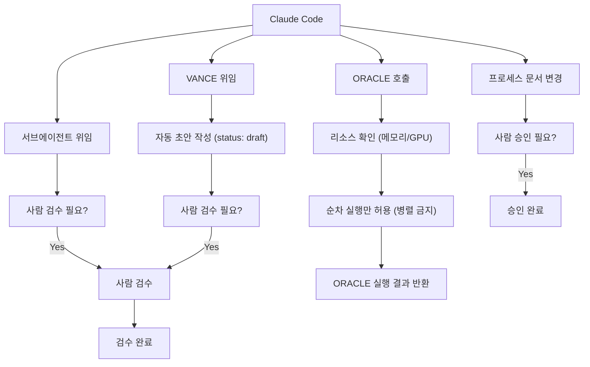

이 다이어그램은 에이전트 조직 구조(Claude Code → 서브에이전트/VANCE/ORACLE)와 각 단계에서 사람의 확인(컨펌)이 필요한 지점을 시각화합니다. 단순 작업은 자동 진행되나, 서브에이전트 결과, VANCE 초안, ORACLE 호출 전 조건, 프로세스 문서 변경 등은 사람 검수/승인이 필수적임을 명시합니다.

에이전트 조직 내 컨펌 체인 요약:  
- **단순 작업** (Claude Code 직접 처리): 컨펌 불필요, 즉시 진행  
- **서브에이전트 결과**: 검수 필요 (나중에 검수)  
- **VANCE 초안**: status: draft → 검수 후 status: reviewed 전환 필수  
- **ORACLE 호출 전**: 리소스(메모리/GPU) 여유 확인 및 **순차 실행만 허용** (병렬 금지)  
- **프로세스 문서(PROCESS_GUIDE.md) 변경**: 승인 필수

**구현**: [tools/confirm-chain/](../../tools/confirm-chain/README.md) — 이 다이어그램을 LangGraph 상태그래프로 옮긴 것이다. 사람 검수·승인 지점을 `interrupt()` 로 강제하고 결정 이력을 체크포인트로 남겨 되돌릴 수 있다. `poetry run python confirm_chain.py <track> "<작업>"`.
