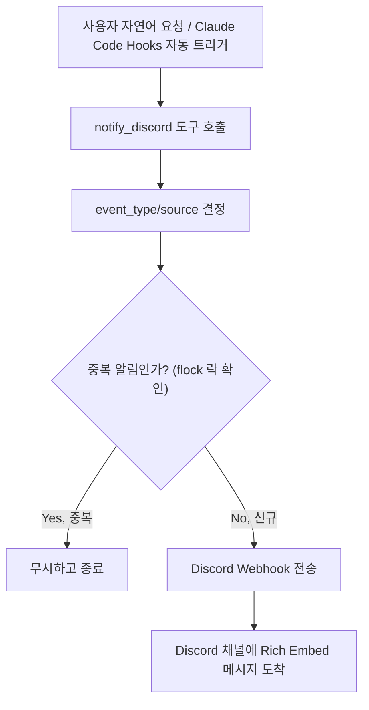

이 문서는 Claude 작업 알림이 Discord로 전달되는 프로세스를 설명합니다. 사용자 자연어 요청 또는 Claude Code Hooks를 통해 알림이 트리거되면, `notify_discord` 도구를 통해 중복 방지 락 체크를 거친 후 Discord Webhook으로 Rich Embed 메시지가 전송됩니다.

| 값       | 색상     | 이모지 | 사용 상황               |
|----------|----------|--------|-------------------------|
| success  | 초록     | ✅     | 작업 성공                |
| error    | 빨강     | ❌     | 오류 발생                |
| warning  | 노랑     | ⚠️     | 주의 필요                |
| info     | 파랑     | ℹ️     | 일반 정보                |
| start    | 하늘     | 🚀     | 작업 시작                |
| complete | 밝은 초록 | 🎉     | 워크플로우 완료          |
| default  | 회색     | 🔔     | 기타                     |

이 흐름은 사용자 요청 또는 Claude Hooks로 알림이 트리거되면 `notify_discord` 도구를 통해 event_type/source를 결정하고, 중복 방지를 위한 flock 락 체크를 거친 후 Discord Webhook으로 Rich Embed 메시지를 전송합니다.
