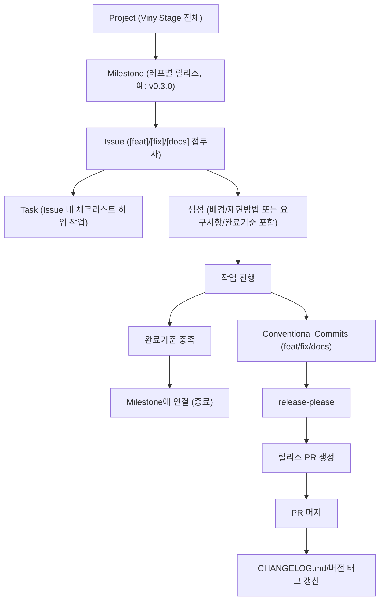

이 문서는 GitHub 프로젝트 관리 계층(Project → Milestone → Issue → Task)과 이슈 생명주기, release-please 자동화 흐름을 시각화한 교육 자료입니다.

GitHub 프로젝트 관리 계층은 VinylStage 조직 전체 Project에서 레포별 Milestone, 기능/버그 단위 Issue, 체크리스트 Task로 계층화되며, 이슈는 생성 → 작업 진행 → 완료기준 충족 → Milestone 연결의 생명주기를 거칩니다. Conventional Commits 규칙 준수 시 release-please가 릴리스 PR을 자동 생성해 CHANGELOG와 버전 태그를 갱신합니다.
