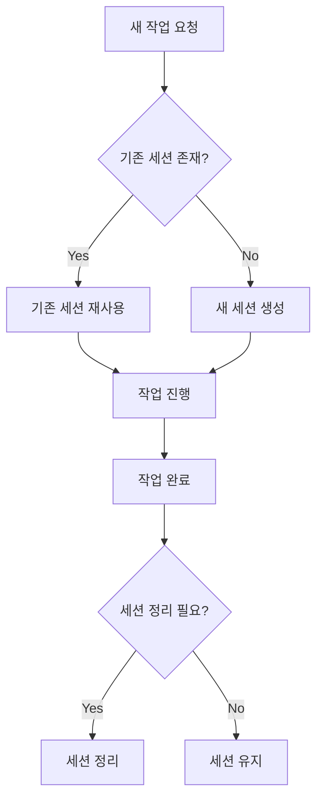

과거 2026년 7월, 동일 작업에 대한 Claude Code 세션이 의도치 않게 중복 생성되며 리소스 낭비가 발생한 사고 이후, **"새 세션 생성 전 기존 세션 존재 여부를 반드시 확인"**하는 절차가 도입되었습니다. 이 흐름은 세션 중복 생성을 방지하고, 컨텍스트 손실 및 자원 낭비를 최소화하기 위해 설계되었습니다.

새 작업 요청 시 기존 세션 존재 여부를 확인하고, 동일 작업 연속성 및 유휴 시간을 기준으로 세션 재사용 또는 신규 생성을 결정하며, 작업 완료 후 불필요한 세션은 즉시 정리합니다.
